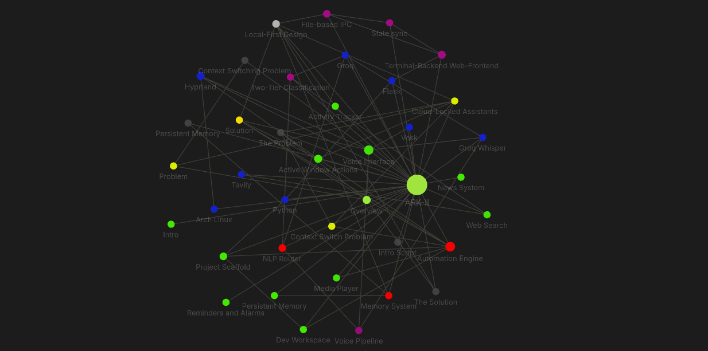

# ARK-II

A voice-controlled personal AI assistant that lives where developers work. It automates tasks and saves a lot of productive hours.

---

## Features

- **Voice interaction** — press `Super+A` anywhere, speak, get a response
- **Persistent memory** — remembers facts across sessions
- **Real-time web search** — Tavily for current info, Groq LLM for everything else
- **Active window actions** — reads your browser, downloads videos, clones repos
- **Automation** — scaffolds projects, launches dev environments, plays media
- **Terminal + Web UI** — two processes, synced through local JSON files

---

## Project Map


> This is ARK-II. Every node is a feature. Every link is a dependency. The yellow cluster is the problem we're solving. The green nodes are what we built. The blue nodes show what we built it on. And it all flows through the center — the assistant itself
---

## Requirements

- **Built on Python 3.14.7**
- **Linux** (developed and tested on Arch Linux + Hyprland)
- A working microphone
- `mpv` (for TTS/audio playback)
- `notify-send` (tested on swaync for notifications)
- [Python Dependencies](https://github.com/arkovyx/ARK-II/blob/master/requirements.txt)
---
### Configuration
```
# make a .env file in the root of the project
cp .env.example .env
# add these things:
GROQ_API_KEY="your_groq_key"
TAVILY_API_KEY="your_tavily_key"
GEMINI_API_KEY="your_gemini_key"
GEMINI_API_KEY_BACKUP="optional_backup_key"
```
|service|link|
|-------|----|
|Groq   |https://console.groq.com|
|Tavily |https://tavily.com|
|Google Gemini| https://aistudio.google.com|
---
### Installation
```
git clone https://github.com/arkovyx/ark-ii.git
cd ark-ii

python -m venv .venv
source .venv/bin/activate

pip install -r requirements.txt

cp .env.example .env # edit .env with your api keys

chmod +x scripts/voice-bar.sh
```
- VOICE MODE(OPTIONAL):
```
# Add to hyprland.lua(keybinds):
hl.bind(mainMod .. " + A", hl.dsp.exec_cmd("~/dev/ark-ii_understanding/scripts/voice-bar.sh"))
```

---
### Usage
>TERMINAL 1:
```
python -m src.main
```
>TERMINAL 2:
```
python server.py
```
>BROWSER:
- dashboard: `http://localhost:8000`
- chat: `http://localhost:8000/chat`
---
```
# Project Structure
.
├── assets
│   └── graph-view.png
├── data
│   ├── ark_intro.wav
│   ├── commands.json
│   ├── media_progress.json
│   ├── memory.json
│   ├── reminders.json
│   └── state.json
├── downloads
│   ├── git
│   └── yt
├── LICENSE
├── __pycache__
│   ├── memory.cpython-314.pyc
│   └── nlp.cpython-314.pyc
├── README.md
├── requirements.txt
├── scripts
│   ├── make_intro.py
│   └── voice-bar.sh
├── server.py
├── src
│   ├── core
│   │   ├── command_reader.py
│   │   ├── __init__.py
│   │   ├── nlp.py
│   │   ├── __pycache__
│   │   │   ├── command_reader.cpython-314.pyc
│   │   │   ├── __init__.cpython-314.pyc
│   │   │   ├── nlp.cpython-314.pyc
│   │   │   └── state.cpython-314.pyc
│   │   └── state.py
│   ├── features
│   │   ├── alarms.py
│   │   ├── download.py
│   │   ├── get.py
│   │   ├── git.py
│   │   ├── __init__.py
│   │   ├── intro.py
│   │   ├── media.py
│   │   ├── memory.py
│   │   ├── news.py
│   │   ├── __pycache__
│   │   │   ├── alarms.cpython-314.pyc
│   │   │   ├── download.cpython-314.pyc
│   │   │   ├── error_fix.cpython-314.pyc
│   │   │   ├── get.cpython-314.pyc
│   │   │   ├── git.cpython-314.pyc
│   │   │   ├── __init__.cpython-314.pyc
│   │   │   ├── intro.cpython-314.pyc
│   │   │   ├── media.cpython-314.pyc
│   │   │   ├── memory.cpython-314.pyc
│   │   │   ├── news.cpython-314.pyc
│   │   │   ├── reminders.cpython-314.pyc
│   │   │   ├── scaffold.cpython-314.pyc
│   │   │   ├── screen.cpython-314.pyc
│   │   │   ├── search.cpython-314.pyc
│   │   │   ├── summarize.cpython-314.pyc
│   │   │   ├── tts.cpython-314.pyc
│   │   │   └── workspace.cpython-314.pyc
│   │   ├── reminders.py
│   │   ├── scaffold.py
│   │   ├── search.py
│   │   ├── stt.py
│   │   ├── summarize.py
│   │   └── workspace.py
│   ├── __init__.py
│   ├── main.py
│   ├── __pycache__
│   │   ├── __init__.cpython-314.pyc
│   │   └── main.cpython-314.pyc
│   ├── utils
│   │   ├── __init__.py
│   │   ├── paths.py
│   │   └── __pycache__
│   │       ├── __init__.cpython-314.pyc
│   │       └── paths.cpython-314.pyc
│   └── voice_bar.py
└── web
    ├── chat.html
    ├── chat.js
    ├── dashboard.js
    ├── index.html
    ├── script.js
    └── style.css

17 directories, 70 files
```
---
> [!IMPORTANT]
> This was built on Arch Linux with Hyprland and my personal
> [dotfiles](https://github.com/arkovyx/dotfiles).
---
### Status

- [x] Terminal chat loop
- [x] Web UI
- [x] Real-time terminal - browser sync
- [x] Two-tier NLP classifier
- [x] Persistent memory
- [x] Voice input via `Super+A`
- [x] Reminders and alarms
- [x] News (RSS)
- [x] Real-time web search (Tavily) ⭐
- [x] Download YouTube video from active tab ⭐
- [x] Clone GitHub repo from active tab ⭐
- [x] Summarize active page ⭐
- [x] Dev environment launcher ⭐
- [x] Python project scaffolder ⭐
- [x] Media player with progress tracking
- [x] Activity tracker
- [x] STT
- [ ] Text-to-speech responses
- [ ] Mail automation
- [ ] Semantic file search
- [ ] File watchdog
